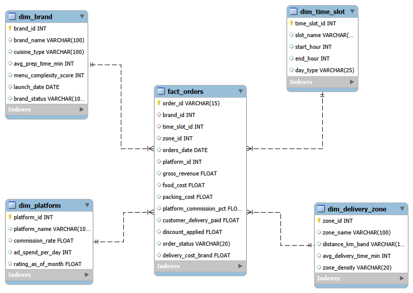
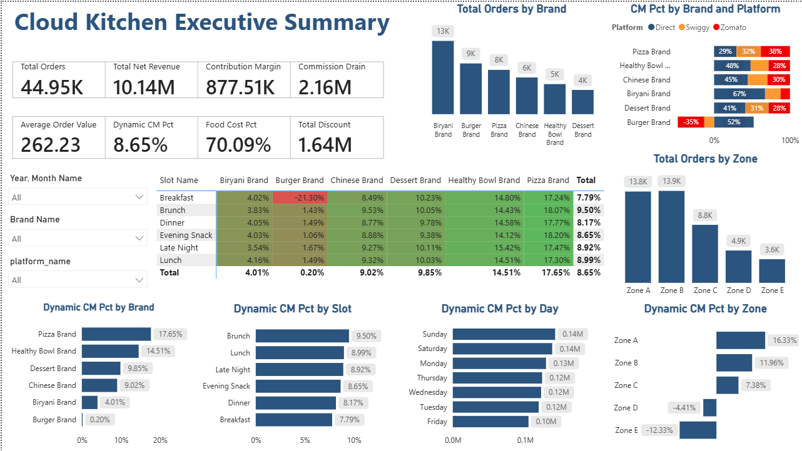

# 🍽️ Dark Kitchen Performance Tracker

> A business intelligence project that analyzes the profitability of multiple virtual brands operating from a single cloud kitchen using SQL and Power BI.


---

# 📌 Project Overview

India's cloud kitchen industry (Rebel Foods, Biryani by Kilo, Curefoods, BOX8 cloud kitchens) is valued at approximately **₹9,500–10,900 crore**.

Unlike generic sales dashboards, this project answers an actual business problem faced by cloud kitchen operators:

> **"Which virtual brand, running from the same kitchen, at which time slot, in which delivery radius, is actually profitable after deducting platform commission, food cost, and packaging cost?"**

This project simulates a multi-brand cloud kitchen environment and provides actionable insights that can improve operational profitability.

---

# 🎯 Business Objectives

- Analyze profitability of each virtual brand
- Measure Contribution Margin (CM%)
- Identify loss-making brands and delivery zones
- Evaluate platform commission impact
- Compare performance across meal slots
- Analyze revenue by weekday
- Recommend strategic business actions

---

# 📊 Dataset

### Source

This dataset is **synthetically generated**.

The dataset was designed using business rules and generated through **Python**, with assistance from ChatGPT. The Python script was executed in **Visual Studio Code**.

### Dataset Details

| Attribute | Value |
|-----------|-------|
| Rows | **50,000** |
| Columns | **14** |
| Date Range | **20 June 2026 – 26 June 2026** |
| Data Type | Synthetic |
| Schema | Star Schema |

---

# 🛠 Tech Stack

- 📊 Power BI
- 🗄 SQL
- 🐍 Python (Dataset Generation)
- 🌳 Git
- 🐙 GitHub

---

# 📁 Project Structure

```

dark_kitchen_performance_tracker/
│
├── data/
│   ├── datasets
│
├── Images/
│   ├── Dashboard Screenshots
│   ├── Data Model
│
├── Power BI/
│   ├── Dashboard.pbix
│
├── reports/
│   ├── Business Report
│
├── SQL/
│   ├── SQL Scripts
│
└── README.md

```

---

# 🚀 Skills Demonstrated

* Data Analysis
* Data Modeling
* SQL Querying
* Data Pipelines
* ETL
* Data Visualization
* Dashboard Development
* KPI Analysis
* Business Intelligence
* Insight Generation


# 📈 Dashboard Analysis

The dashboard evaluates profitability from multiple business perspectives including:

- Virtual Brand Performance
- Delivery Zone Performance
- Contribution Margin
- Platform Commission
- Food Cost
- Packaging Cost
- Discounts
- Revenue Trends
- Time Slot Analysis
- Weekday Performance

---

# 💡 Key Business Insights & Recommendations

---

## 🍔 1. Fix or Exit Burger Brand Breakfast Slot

- Breakfast Contribution Margin is **-21.30%**
- Current pricing is unsustainable.

### Recommendation

- Reprice breakfast menu
- Remove high-cost items
- Run a 30-day pricing experiment
- Exit breakfast category if profitability does not improve

---

## 🚫 2. Improve Zone D & Zone E Operations

Zone E records a **-12.33% Contribution Margin**, meaning every order results in a loss.

### Recommendation

- Optimize delivery cost
- Reduce delivery radius
- Improve order density
- Exit the zone if profitability is not achieved within 60 days

---

## 💰 3. Renegotiate Platform Commissions

Platform commission expenses total **₹2.16M**, while Contribution Margin is only **₹877K**.

### Recommendation

- Increase Direct Platform orders
- Negotiate lower commission rates
- Reduce dependency on third-party aggregators

---

## 🥗 4. Reduce Food Cost Below 65%

Current food cost stands at **70.09%**, exceeding the industry benchmark.

### Recommendation

- Audit high-cost ingredients
- Standardize recipes
- Reduce portion variance
- Negotiate supplier contracts

Even a **5% reduction** in food cost could significantly improve profitability.

---

## 🍕 5. Scale the Pizza Brand

Pizza demonstrates the strongest combination of:

- High order volume
- Strong Contribution Margin
- Stable profitability

### Recommendation

- Increase marketing budget
- Launch combo offers
- Introduce loyalty programs
- Expand product variety

---

## 🥗 6. Grow Healthy Bowl Strategically

Healthy Bowl has:

- Only **5K orders**
- Contribution Margin of **14.51%**

It is profitable but underutilized.

### Recommendation

Target:

- Zone A
- Zone B

with focused marketing campaigns.

---

## 🎁 7. Reduce Discount Leakage

Total discounts amount to **₹1.64M**.

### Recommendation

Replace blanket discounts with:

- Loyalty rewards
- Personalized offers
- Repeat customer incentives

---

## 🍱 8. Capitalize on Brunch & Lunch Slots

Highest Contribution Margin:

- Brunch → **9.50%**
- Lunch → **8.99%**

### Recommendation

Launch:

- Brunch Combo
- Lunch Special
- Meal Bundles

---

## 📅 9. Weekend Revenue Push

Saturday and Sunday generate the highest revenue.

### Recommendation

- Weekend-exclusive offers
- Family meal bundles
- Targeted marketing in Zone A & Zone B

---

## 📉 10. Improve Friday Performance

Friday records the lowest revenue.

### Recommendation

- Investigate demand drivers
- Avoid deep discounts on low-margin brands
- Promote high-margin products instead

---

# 📊 Business Impact

This dashboard enables stakeholders to:

- Identify profitable brands
- Detect loss-making operations
- Improve pricing strategy
- Optimize delivery zones
- Reduce operational costs
- Increase Contribution Margin
- Support data-driven decision making

---

# 🚀 Future Improvements

- Forecast demand using Machine Learning
- Customer segmentation
- Cohort Analysis
- Customer Lifetime Value (CLV)
- Inventory Optimization
- Dynamic Pricing
- Real-time Dashboard Integration
- Predictive Profitability Model

---

# Data Model Preview



# 📸 Dashboard Preview



## Dashboard Preview version2


---

# ▶️ How to Run the Project

1. Clone the repository

```bash
git clone https://github.com/yourusername/dark_kitchen_performance_tracker.git
````

2. Open the Power BI dashboard

```
Power BI/Dashboard.pbix
```

3. Review SQL scripts

```
SQL/
```

4. Explore the reports and dashboard screenshots.

---

# 📂 Repository Contents

| Folder   | Description                        |
| -------- | ---------------------------------- |
| data     | Synthetic datasets                 |
| Images   | Dashboard screenshots & data model |
| Power BI | Power BI dashboard                 |
| reports  | Business reports                   |
| SQL      | SQL scripts                        |

---

# 👨‍💻 Author

**Achyut Bhardwaz**

Aspiring Data Analyst passionate about solving real-world business problems through SQL, Power BI, and data storytelling.

**GitHub:** @AchyutBhardwaz

---

# ⭐ If you found this project useful

Please consider giving the repository a **Star ⭐** to support my work.

```
```
